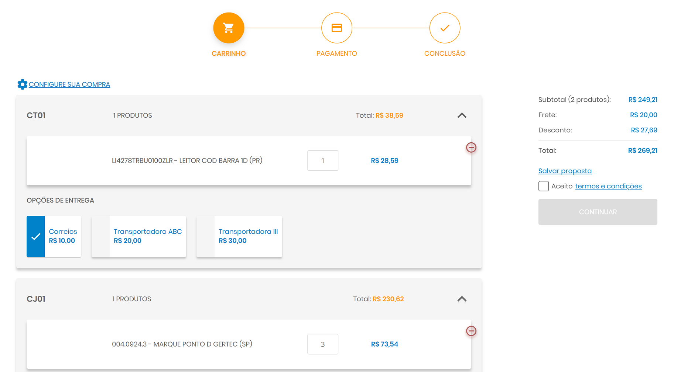
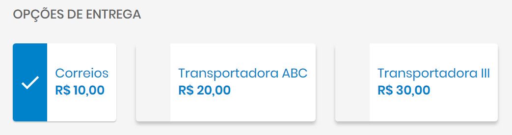
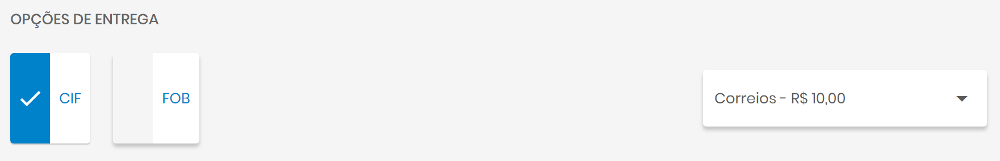

Novo Checkout
=============

A partir da versão 19.15 do Site B2B colocamos no ar um novo modelo de checkout.

Esse novo módulo foi construído para atender as seguintes necessidades:

- Modernizar a aparência do processo de checkout da plataforma
- Responder rapidamente à mudanças no carrinho
- Agilizar a edição dos dados no checkout
- Reduzir o número de passos e cliques do usuário no funil de compras e capturar mais pedidos
- Reorganizar o código-fonte para todos os plugins de pagamento

Com isso a GI API também sofreu alterações. Um novo endpoint foi criado: /checkout, que serve para controlar todos os passos do novo checkout. Para os clientes que já possuem a integração funcionando, não é necessário atualizar a API, pois criamos um modo de compatibilidade com a integração antiga. A atualização da API é indicada para os seguintes cenários:

- Permitir seleção de frete separado por centro de distribuição
- Permitir seleção de frete em dois níveis (mais detalhes abaixo)
- Ter maior controle sobre os preços dos produtos, frete e pagamento de acordo com o carrinho de compras

Para os novos clientes do Site B2B o uso do novo endpoint /checkout é obrigatório.

Para os clientes já existentes criamos um modo de compatibilidade com as APIs de /frete e /prazopagamento. A maior diferença é que com esse modo, não é possível aproveitar todos os novos recursos do novo checkout, como a possibilidade de ter um frete único por CD.

O guia abaixo mostra como funciona esse novo endpoint e quais os cuidados que devem ser tomados para sua correta implementação.

Cenário
-------

O antigo modelo de checkout fragmentava as informações em diferentes chamadas para a GI API:

- /preco - retornava o preço de cada item do carrinho
- /frete - calculava o total de frete baseado no carrinho de compras
- /prazopagamento - retornava as opções de pagamento total para cada plugin de pagamento, baseado no carrinho e frete

O novo modelo centraliza todas essas informações em um único endpoint. Com isso, cada alteração no checkout dispara uma nova chamada para a api /checkout com o ESTADO COMPLETO do checkout, ou seja, o carrinho, o frete selecionado, o pagamento selecionado e etc.
A idéia desse modelo é permitir que a integração tenha um controle maior para a precificação dos itens, opções de frete individuais para cada CD e totais para cada plugin de pagamento de forma única.

Gerenciando o estado do checkout
--------------------------------

Dessa maneira, apesar de agora todas as chamadas serem centralizadas em uma única API, a integração precisa ter o cuidado de gerenciar corretamente o estado do carrinho de compras e otimizar as chamadas para que o desempenho de cada requisição-resposta seja rápido.
Para ilustrar melhor esse conceito segue abaixo um exemplo de como funcionaria na prática todo o processo de checkout para um usuário João com dois itens em seu carrinho de compras:

**Primeiro request**

Quando um checkout se inicia, o request a ser enviado inicialmente para o /checkout traz apenas os preços já calculados pelo B2B durante a navegação do usuário e também um ID.
Esse ID será mantido por todas as chamadas subsequentes dessa sessão de checkout do usuário. Com isso é possível criar uma estratégia de cache dos preços e totais calculados para que as demais chamadas dessa sessão de checkout não precisem ser recalculadas.

  .. code-block:: json

    {
        "Id": "1e1f4674-fe4a-4424-a7b8-8c50a04822bc",
        "TipoDePedido": { "Tipo": 0, "RevendaId": 1, "ClienteFinalId": null },
        "Itens": [
            {
            "PartNumber": "004.0924.3",
            "CentroDeDistribuicaoPrefix": "CJ01",
            "Sku": "SKU_1",
            "Quantidade": 1,
            "PrecoUnitarioSemDesconto": 81.71,
            "PrecoUnitarioBase": 81.71,
            "PrecoUnitarioComissionado": null,
            "BundleId": null
            },
            {
            "PartNumber": "10006995K",
            "CentroDeDistribuicaoPrefix": "VT01",
            "Sku": "SKU_2",
            "Quantidade": 1,
            "PrecoUnitarioSemDesconto": 46.66,
            "PrecoUnitarioBase": 46.66,
            "PrecoUnitarioComissionado": null,
            "BundleId": null
            }
        ],
        "FretesSelecionados": [],
        "PagamentoSelecionadoId": null,
        "PagamentoSelecionadoTotalId": null,
        "InformacoesPagamento": {},
        "Descontos": [],
        "Extras": {}
     }

Nesse momento o B2B irá esperar como resposta as opções de frete e pagamento para esse carrinho.
É possível também alterar completamente os preços do carrinho caso desejado, ou de acordo com o que o usuário selecionar posteriormente.

  .. code-block:: json

    {
        "id": "1e1f4674-fe4a-4424-a7b8-8c50a04822bc",
        "itens": [
            {
            "partNumber": "004.0924.3",
            "centroDeDistribuicaoPrefix": "CJ01",
            "sku": "SKU_1",
            "quantidade": 1,
            "precoUnitarioSemDesconto": 81.71,
            "precoUnitarioBase": 81.71,
            "precoUnitarioComissionado": 81.71,
            "valorComissao": 0.0,
            "bundleId": null
            },
            {
            "partNumber": "10006995K",
            "centroDeDistribuicaoPrefix": "VT01",
            "sku": "SKU_2",
            "quantidade": 1,
            "precoUnitarioSemDesconto": 46.66,
            "precoUnitarioBase": 46.66,
            "precoUnitarioComissionado": 46.66,
            "valorComissao": 0.0,
            "bundleId": null
            }
        ],
        "fretes": {
            "centrosDeDistribuicao": [
            {
                "prefixo": "CJ01",
                "opcoes": [
                {
                    "id": "CJ01-A",
                    "nome": "Correios",
                    "descricao": null,
                    "valorSemDesconto": 10.0,
                    "valor": 10.0,
                    "subOpcoes": []
                },
                {
                    "id": "CJ01-B",
                    "nome": "Transportadora ABC",
                    "descricao": null,
                    "valorSemDesconto": 20.0,
                    "valor": 20.0,
                    "subOpcoes": []
                },
                {
                    "id": "CJ01-C",
                    "nome": "Transportadora III",
                    "descricao": null,
                    "valorSemDesconto": 30.0,
                    "valor": 30.0,
                    "subOpcoes": []
                }
                ]
            },
            {
                "prefixo": "VT01",
                "opcoes": [
                {
                    "id": "VT01-A",
                    "nome": "CIF",
                    "descricao": null,
                    "valorSemDesconto": null,
                    "valor": null,
                    "subOpcoes": [
                    {
                        "id": "VT01-A-a",
                        "nome": "Correios",
                        "valorSemDesconto": 10.0,
                        "valor": 10.0
                    },
                    {
                        "id": "VT01-A-b",
                        "nome": "Transportadora ABC",
                        "valorSemDesconto": 10.0,
                        "valor": 10.0
                    },
                    {
                        "id": "VT01-A-c",
                        "nome": "Transportadora III",
                        "valorSemDesconto": 10.0,
                        "valor": 10.0
                    }
                    ]
                },
                {
                    "id": "VT01-B",
                    "nome": "FOB",
                    "descricao": null,
                    "valorSemDesconto": null,
                    "valor": null,
                    "subOpcoes": [
                    {
                        "id": "VT01-B-a",
                        "nome": "Correios",
                        "valorSemDesconto": 25.0,
                        "valor": 25.0
                    },
                    {
                        "id": "VT01-B-b",
                        "nome": "Transportadora ABC",
                        "valorSemDesconto": 25.0,
                        "valor": 25.0
                    },
                    {
                        "id": "VT01-B-c",
                        "nome": "Transportadora III",
                        "valorSemDesconto": 25.0,
                        "valor": 25.0
                    }
                    ]
                }
                ]
            }
            ]
        },
        "pagamentos": [
            {
            "formaDePagamento": "Faturado",
            "totais": [
                {
                "id": "Faturado-1",
                "nome": "1x",
                "descricao": "1x R$128.37 de R$128.37",
                "numeroParcela": 1,
                "valorParcela": 128.37,
                "valorTotal": 128.37,
                "valorDesconto": null,
                "porcentagemDesconto": null,
                "encargosFinanceiros": 0.0,
                "detalhesEncargosFinanceiros": []
                },
                {
                "id": "Faturado-2",
                "nome": "2x",
                "descricao": "2x R$64.18 de R$128.37",
                "numeroParcela": 2,
                "valorParcela": 64.18,
                "valorTotal": 128.37,
                "valorDesconto": null,
                "porcentagemDesconto": null,
                "encargosFinanceiros": 0.0,
                "detalhesEncargosFinanceiros": []
                },
                {
                "id": "Faturado-3",
                "nome": "3x",
                "descricao": "3x R$42.79 de R$128.37",
                "numeroParcela": 3,
                "valorParcela": 42.79,
                "valorTotal": 128.37,
                "valorDesconto": null,
                "porcentagemDesconto": null,
                "encargosFinanceiros": 0.0,
                "detalhesEncargosFinanceiros": []
                }
            ]
            },
            {
            "formaDePagamento": "Cartão",
            "totais": [
                {
                "id": "Cartão-1",
                "nome": "1x",
                "descricao": "1x R$128.37 de R$128.37",
                "numeroParcela": 1,
                "valorParcela": 128.37,
                "valorTotal": 128.37,
                "valorDesconto": null,
                "porcentagemDesconto": null,
                "encargosFinanceiros": 0.0,
                "detalhesEncargosFinanceiros": []
                },
                {
                "id": "Cartão-2",
                "nome": "2x",
                "descricao": "2x R$64.18 de R$128.37",
                "numeroParcela": 2,
                "valorParcela": 64.18,
                "valorTotal": 128.37,
                "valorDesconto": null,
                "porcentagemDesconto": null,
                "encargosFinanceiros": 0.0,
                "detalhesEncargosFinanceiros": []
                }
            ]
            }
        ],
        "subtotais": [
            {
            "centroDeDistribuicaoPrefix": "CJ01",
            "frete": 0.0,
            "total": 81.71
            },
            {
            "centroDeDistribuicaoPrefix": "VT01",
            "frete": 0.0,
            "total": 46.66
            }
        ],
        "total": {
            "total": 128.37,
            "subtotal": 128.37,
            "valorDesconto": 0.0,
            "totalFrete": 0.0
        },
        "mensagens": []
    }

**Regras:**

- É OBRIGATÓRIO devolver o mesmo ID que foi enviado no request
- É OBRIGATÓRIO devolver pelo menos uma opção de frete por CD, cada opção obrigatoriamente com um ID próprio
- É OBRIGATÓRIO devolver opções de pagamento para cada plugin disponível no site, cada uma com um ID próprio
- É OBRIGATÓRIO calcular corretamente todos os subtotais e totais pela api /checkout. Isso dá maior poder para que o ERP possa calcular livremente os preços e ajustar qualquer regra de taxa/impostos livremente
- No request inicial o usuário ainda não selecionou: tipo de venda, frete e pagamento. A API deve lidar com esses valores em branco sem retornar nenhum erro.

No caso acima são ilustradas duas formas de fornecer opções de frete: a tradicional e uma com mais de um nível, permitindo por exemplo opções FOB e CIF com sub-opções a serem exibidas em um drop-down.

**Modelos de frete**

No exemplo de resposta acima vemos dois tipos de modelos de frete:

  .. code-block:: json

    ...
    {
        "prefixo": "CJ01",
        "opcoes": [
          {
            "id": "CJ01-A",
            "nome": "Correios",
            "descricao": null,
            "valorSemDesconto": 10.0,
            "valor": 10.0,
            "subOpcoes": []
          },
          {
            "id": "CJ01-B",
            "nome": "Transportadora ABC",
            "descricao": null,
            "valorSemDesconto": 20.0,
            "valor": 20.0,
            "subOpcoes": []
          },
          {
            "id": "CJ01-C",
            "nome": "Transportadora III",
            "descricao": null,
            "valorSemDesconto": 30.0,
            "valor": 30.0,
            "subOpcoes": []
          }
        ]
    },
    ...

Esse é o modelo tradicional que traz as opções de forma simples, por Centro de Distribuição, conforme imagem acima.

  .. code-block:: json

    ...
    {
        "prefixo": "VT01",
        "opcoes": [
          {
            "id": "VT01-A",
            "nome": "CIF",
            "descricao": null,
            "valorSemDesconto": null,
            "valor": null,
            "subOpcoes": [
              {
                "id": "VT01-A-a",
                "nome": "Correios",
                "valorSemDesconto": 10.0,
                "valor": 10.0
              },
              {
                "id": "VT01-A-b",
                "nome": "Transportadora ABC",
                "valorSemDesconto": 10.0,
                "valor": 10.0
              },
              {
                "id": "VT01-A-c",
                "nome": "Transportadora III",
                "valorSemDesconto": 10.0,
                "valor": 10.0
              }
            ]
          },
          {
            "id": "VT01-B",
            "nome": "FOB",
            "descricao": null,
            "valorSemDesconto": null,
            "valor": null,
            "subOpcoes": [
              {
                "id": "VT01-B-a",
                "nome": "Correios",
                "valorSemDesconto": 25.0,
                "valor": 25.0
              },
              {
                "id": "VT01-B-b",
                "nome": "Transportadora ABC",
                "valorSemDesconto": 25.0,
                "valor": 25.0
              },
              {
                "id": "VT01-B-c",
                "nome": "Transportadora III",
                "valorSemDesconto": 25.0,
                "valor": 25.0
              }
            ]
          }
        ]
    }
    ...

O modelo 2 traz sub-opções, permitindo escolhas de frete mais dinâmicas que são exibidas conforme modelo acima.

OBS: para os clientes que já estão integrados com o B2B sem a nova API de /checkout, somente o modelo 1 será permitido e o frete será por carrinho e não por CD.

**Métodos de pagamento**

A estrutura para o fornecimento dos totais de pagamento é bastante similar à antiga API de /prazopagamento.

A GIAPI deve retornar um conjunto de formas de pagamento, cada uma contendo as opções de parcelamento disponíveis para o carrinho em questão, bem como os seus totais respectivos.

O nome a ser usado no campo "formaDePagamento" depende de quais plugins serão disponibilizados com o seu B2B. Consulte o nosso suporte técnico para saber quais são os nomes corretos a serem utilizados em cada plugin.

Retornando erros
----------------

Caso o estado do carrinho atual esteja com algum problema ou invalidado por alguma regra de negócio, é possível retornar erros no objeto "mensagens". Os erros serão exibidos na tela de acordo com sua criticidade.

Descontos
---------

Os descontos aplicados pelo B2B são enviados no objeto Descontos dentro do CheckoutRequest.
Os descontos devem ser calculados pelo ERP e aplicados corretamente nos totais, de acordo com o tipo de desconto informado e qual sua aplicação.

A propriedade TipoDesconto indica qual o tipo de desconto cadastrado no B2B sendo aplicado no carrinho:

- 0 - Produto
- 1 - Bundle
- 2 - Categoria
- 3 - Frete
- 4 - Subtotal
- 5 - Total

O desconto terá preenchida a propriedade PorcentagemDesconto ou ValorDesconto, para indicar se o cálculo deve ser percentual ou absoluto de acordo com o preço do produto/frete/total.

Cada PartNumber do carrinho terá indicado seu desconto específico. O ERP não precisa classificar ou ordenar esse desconto, basta ler o desconto de cada item e aplicar de acordo com o que está preenchido no objeto Request. A lógica fica por conta do B2B.

Itens Selecionados
------------------

Conforme o usuário navega pelo checkout, ele irá selecionar as opções de frete e pagamento. Cada alteração no estado do checkout leva a outro request para a API do /checkout, sempre com o mesmo ID para que o integração possa manter também um estado do carrinho e evitar recalcular tudo a cada request novo.

É possível verificar quais são as opções selecionadas pelo usuário através dos objetos 'FretesSelecionados', 'PagamentoSelecionadoId' e 'PagamentoSelecionadoTotalId'.

- FretesSelecionados: lista com o ID de cada opção de frete selecionada por CD
- PagamentoSelecionadoId: nome do plugin de pagamento selecionado (igual ao campo "formaDePagamento" da resposta)
- PagamentoSelecionadoTotalId: ID da opção de pagamento selecionada

Fechamento de Pedido
--------------------

Quando o usuário do site resolver concluir o pedido, uma última chamada para o /checkout será realizada para uma validação final - essa chamada não difere das outras, portanto não existe nenhum tipo de validação adicional a ser efetuada pela GIAPI.
Caso não exista nenhum erro, a API de pedido será chamada (no.