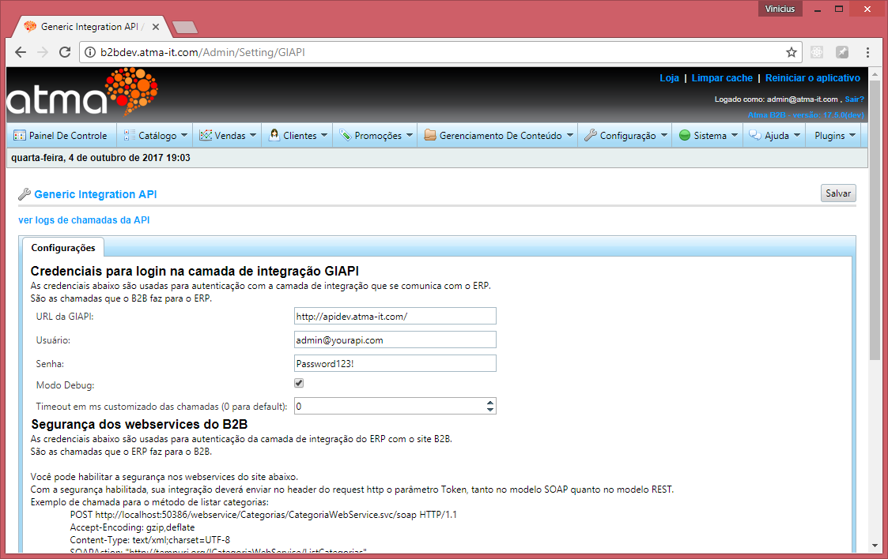

Preparação do ambiente
======================

Para iniciar a construção de sua própria GIAPI, existem duas maneiras:

- Utilizar o ClientTemplate fornecido pela Atma como base
- Criar sua própria GIAPI utilizando a linguagem de sua preferência, respeitando estritamente todos os objetos de request e response

Independente da opção selecionada, a GIAPI deve ser publicada em um domínio web público para que se conecte ao Site B2B, exceto no caso do Site B2B estar hospedado em um servidor local ou rede interna que possa enxergar a GIAPI em um endereço local.
Dentro do Site B2B, deve-se apontar o endereço base da GIAPI através do menu Configuração > Configurações > Configuração GIAPI.

Verificando os envios e respostas
---------------------------------

Para facilitar o processo de desenvolvimento da GIAPI, é possível logar e acompanhar todas as chamadas realizadas para a GIAPI, bem como as respostas recebidas do servidor.

Dessa maneira torna-se mais fácil encontrar erros de comunicação e também entender melhor o fluxo das chamadas do sistema.

Para habilitar os logs basta ativar o checkbox Modo Debug conforme a figura acima.

Para verificar os logs basta clicar no link "ver logs de chamadas da API", logo acima da aba Configurações conforme a figura acima.