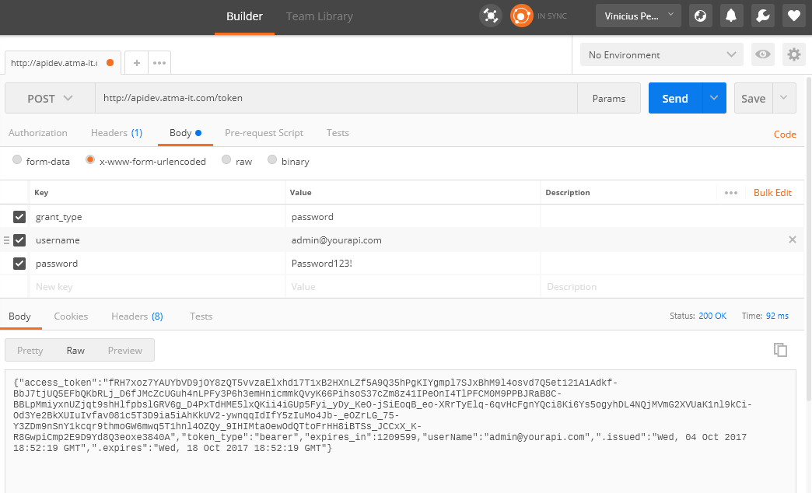

Token de autenticação
=====================

**O primeiro item a ser realizado na GIAPI é o funcionamento correto do token de autenticação.**

Independente da plataforma utilizada, o token de autenticação deve seguir estritamente o padrão descrito nesse documento. O sistema de token fornece a autenticação necessária para que o Site B2B se comunique com a GIAPI.

O cliente que utilizar o nosso ClientTemplate da GIAPI como modelo já tera o sistema de token por padrão. O ASP.NET Web API 2 fornece esse sistema de autenticação default. Caso contrário, ele deve ser implementado na linguagem desejada pelo cliente, **após um estudo sobre qual tecnologia será a mais adequada para prover a solução**.

Conceito
--------

- Antes de tudo é necessário configurar a GIAPI, colocando a URL pública da API, o usuário e a senha através do Admin do Site B2B **(Admin do Site B2B > Configuração > Configurações > Configuração GIAPI)**. O usuário e senha são determinados pelo cliente.
- O Site B2B, antes de qualquer chamada para a GIAPI, vai verificar se já existe em memória um token de autenticação e se ele ainda não expirou.
- Caso não tenha o token ou ele tenha expirado, o Site B2B irá chamar a URL da GIAPI + /token.
     Ex: http://www.minhagiapi.com.br/token
- O Site B2B irá fazer uma chamada POST para o http://www.minhagiapi.com.br/token passando as seguintes informações:
   - grant_type: "password" (valor fixo padrão)
   - username: nome de usuário configurado na tela Admin do Site B2B
   - password: senha configurada na tela Admin do Site B2B

   Eis um exemplo de chamada retirado do **Fiddler**, para a URL "http://apidev.atma-it.com/", usuário "admin@yourapi.com" e senha "Password123!":

   .. code-block:: html

      POST http://apidev.atma-it.com/token HTTP/1.1
      Host: apidev.atma-it.com
      Content-Type: application/x-www-form-urlencoded

      grant_type=password&username=admin%40yourapi.com&password=Password123!

- A GIAPI deve retornar um token de autenticação através de uma resposta JSON no seguinte formato (OBRIGATÓRIO):

  .. code-block:: json

      Content-Type: application/json

      {
         "access_token": "l8Im3uUH1Oxs8Dwj…DBza3-eDS7cDDh4hCSQdx",
         "expires_in": 1209599
      }
   
  - **access_token**: é uma string que corresponde ao token retornado pela GIAPI. Ela será enviada no HEADER de todas as chamadas para a GIAPI. Cabe ao cliente validar esse token em toda chamada para garantir a segurança da comunicação.
  - **expires_in**: indica a quantidade de segundos que o token é válido. Quando esse tempo expirar, o Site B2B irá realizar uma nova chamada para o /token.

Para testar de forma simples indicamos o uso do **Postman**, realizando a chamada conforme exemplo abaixo.

É possível também testar a chamada do Site B2B para a GIAPI através do log de chamadas, conforme citado no tópico :doc:`Preparando o ambiente <preparo>`.