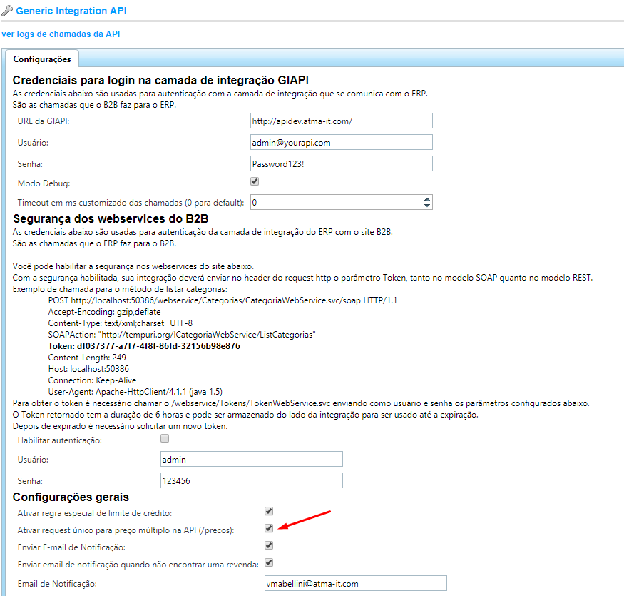

Precificação
============

O Site B2B permite que o cliente adapte sua estratégia de preço de acordo com a necessidade de seu negócio.
Para isso, a plataforma envia para a GIAPI vários dados sobre quem é o cliente logado, qual o contexto da navegação (ele está na vitrine? Na tela de checkout?) e também os dados do cliente final (caso seja uma venda comissionada).
Além disso temos o simulador de preços para que o vendedor possa estimar os custos de uma venda sem muitos detalhes do cliente final.

Estrutura de preços
-------------------

Abaixo segue um exemplo de request enviado para a api de preço (api/v1/preco):

   .. code-block:: json

      {  
         "PartNumber":"006R01153-NO",
         "Skus":null,
         "ClienteFinalId":1,
         "TipoClienteFinal":0,
         "TipoPreco":0,
         "DetalharImpostos":false,
         "VendedorRevendaId":1
      }

- **PartNumber:** Part Number do produto a retornar preço
- **Skus**: Esse campo é preenchido pelo Site B2B somente quando o cliente utiliza o "Modo manual" para gerenciar os variantes. Para mais detalhes, :doc:`clique aqui <../../webservices-b2b/produto/index>`.
- **ClienteFinalId**: É o ID da revenda ou do cliente final dentro do ERP. Para saber qual é o tipo, deve-se ler a propriedade TipoClienteFinal.
- **TipoClienteFinal**: Informa qual o tipo do campo ClienteFinalId.
  - Revenda = 0
  - ClienteFinal = 1
- **TipoPreco**: Informa qual o contexto do cliente. "CatalogoDoSite" diz que o preço vai ser exibido nas telas de busca, vitrine e detalhe de produto. Os demais contextos indicam que está no checkout.
  - CatalogoDoSite = 0
  - CheckoutVendaConsumo = 1
  - CheckoutVendaRevenda = 2
  - CheckoutVendaComissionada = 3
  - CheckoutVendaComissionadaRevenda = 4
- **DetalharImpostos**: Boolean indicando se a GIAPI deve detalhar ou não os impostos na resposta.
- **VendedorRevendaId**: Informa o ID da revenda do vendedor. Útil para quando for uma venda comissionada.

API de /precos
--------------

Além da API de preço convencional, é possível também ativar uma outra ponta chamada api/v1/precos.
Essa API pode ser muito útil para otimizar o desempenho do Site B2B e diminuir a carga de chamadas para a GIAPI. Com ela, as áreas do site que necessitam de várias chamadas de preço (como por exemplo a home page ou os resultados de busca) enviam uma única chamada para a API de preços, com um array de Part Numbers.
Para que o Site B2B use a chamada para o api/v1/precos, basta ativar a configuração abaixo:

Simulador de preços
-------------------

Outra funcionalidade muito útil do Site B2B é a capacidade de simular preços, fazendo com que o revendedor consiga passar um orçamento para um cliente sem precisar cadastrá-lo no ERP antes.

   .. code-block:: json

      {  
         "PartNumber":"SDSDX008GX46",
         "Skus":null,
         "Estado":"SP",
         "Consumo":true,
         "Contribuinte":true,
         "RevendaId":1,
         "DetalharImpostos":false
      }

- **PartNumber:** Part Number do produto a retornar preço
- **Skus**: Esse campo é preenchido pelo Site B2B somente quando o cliente utiliza o "Modo manual" para gerenciar os variantes. Para mais detalhes, :doc:`clique aqui <../../webservices-b2b/produto/index>`.
- **Estado**: UF de origem (2 letras).
- **Consumo**: Boolean indicando se a venda a ser realizada é do tipo consumo ou revenda.
- **Contribuinte**: Boolean indicando se o cliente é contribuinte ou não.
- **RevendaId**: Id da revenda que está realizando a simulação.
- **DetalharImpostos**: Boolean indicando se a GIAPI deve detalhar ou não os impostos na resposta.