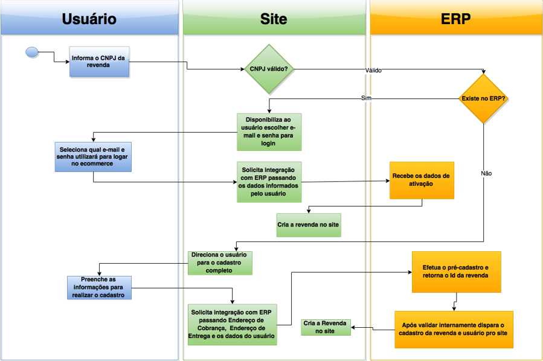

Fluxo de integração de revenda (SRM/RMA)
========================================

O diagrama abaixo ilustra o fluxo de cadastro de revenda:

Conceitos principais
--------------------

- **Toda revenda é criada via webservice apenas (exceto FastTrack)**
     Quando um cliente realiza o cadastro de sua revenda pelo Site B2B, a revenda não é criada automaticamente. Ao invés disso, ela é armazenada em uma tabela de pré-cadastro e seus dados são enviados via GIAPI para o ERP, para que ocorra o processo de análise e aprovação/rejeição seguindo o fluxo de cada cliente.
- **Toda revenda deve ter um usuário MASTER**
     A revenda em si é apenas uma entidade que representa uma empresa no sistema, mas quem efetua login e faz os pedidos são os **vendedores** da revenda. Por isso, toda revenda deve possuir um usuário MASTER.
     O usuário MASTER é o administrador daquela revenda e possui total acesso a todos as informações da revenda no Site B2B, bem como visualizar pedidos, comissões e também ter o poder de criar usuários CONVIDADOS.
- **Toda revenda pode possuir N usuários CONVIDADOS**
     Além do usuário MASTER que possui permissão total dentro da revenda, é possível que a revenda crie N usuários CONVIDADOS.
     Cada usuário CONVIDADO pode ter restrições específicas de acesso ao site, sendo que essas restrições são configuráveis via Admin do Site B2B.

FastTrack
---------

Em construção

Criação de revenda
------------------

A partir da versão 17.5.0 do Site B2B nós criamos um novo método de criação de revenda chamado **CreateRevendaCompleta**.

O **CreateRevendaCompleta** é semelhante ao antigo **CreateRevenda**, com a diferença que ele recebe também durante a criação os endereços de Cobrança e Entrega. Dessa maneira nós evitamos uma série de problemas com revendas sem endereço, pois através desse método garantimos a atomicidade da operação validando os endereços essenciais. Na versão anterior, era necessário utilizar o método **SetRevendaEndereco** separadamente.

Cenários possíveis
------------------

**Cenário 1: a revenda existe no ERP e possui usuário cadastrado com senha**

- O ERP deve enviar os dados da revenda através do webservice de Revenda, método CreateRevendaCompleta
- Em caso de sucesso, o ERP deve enviar pelo menos o usuário MASTER através do webservice de Revenda, método CreateUsuario, com a senha inicial do usuário

**Cenário 2: a revenda existe no ERP, possui usuários, porém nenhum tem senha**

- Usuário da revenda acessa o Site B2B e tenta fazer o cadastro da revenda pelo CNPJ
- O Site B2B chama o método da GIAPI para consultar a revenda pelo CNPJ (http://apidev.atma-it.com/Help/Api/GET-api-v1-revenda_cnpj)
- A GIAPI retorna os dados da revenda
- O Site B2B chama o método da GIAPI para consultar quais são os contatos cadastrados para essa revenda no ERP (http://apidev.atma-it.com/Help/Api/GET-api-v1-revenda-revendaId-contatos)
- A GIAPI retorna uma lista de contatos vinculados à revenda
- O Site B2B exibe a lista de contatos para que o usuário escolha qual deles é o usuário MASTER. Através do Site B2B ele escolhe qual desses contatos é o MASTER e também define uma senha de acesso.
- O Site B2B chama a GIAPI de ativação de revenda (http://apidev.atma-it.com/Help/Api/POST-api-v1-revenda-revendaId-ativacao) passando o e-mail do contato e a senha escolhida
- O ERP deve então realizar a integração de revenda normalmente conforme o Cenário 1

**Cenário 3: a revenda não existe no ERP**

- Usuário da revenda acessa o Site B2B e tenta fazer o cadastro da revenda pelo CNPJ
- O Site B2B chama o método da GIAPI para consultar a revenda pelo CNPJ (http://apidev.atma-it.com/Help/Api/GET-api-v1-revenda_cnpj)
- A GIAPI retorna um código de erro 404 indicando que não foi encontrado nenhum registro para essa revenda
- O Site B2B então entra no fluxo de cadastro da revenda
- Depois do fluxo ser finalizado, o Site B2B armazena tudo em tabelas de pré-cadastro de revenda e em seguida envia via GIAPI para (http://apidev.atma-it.com/Help/Api/POST-api-v1-revenda)
- No lado do ERP, cada cliente deve lidar de sua maneira com a solicitação da nova revenda. Geralmente ocorre um processo manual de análise e aprovação, para que essa revenda entre em seguida na base do ERP
- O ERP deve então realizar a integração de revenda normalmente conforme o Cenário 1

**Cenário 4: a revenda existe no ERP porém não tem nenhum contato cadastrado**

- Usuário da revenda acessa o Site B2B e tenta fazer o cadastro da revenda pelo CNPJ
- O Site B2B chama o método da GIAPI para consultar a revenda pelo CNPJ (http://apidev.atma-it.com/Help/Api/GET-api-v1-revenda_cnpj)
- A GIAPI retorna os dados da revenda
- O Site B2B chama o método da GIAPI para consultar quais são os contatos cadastrados para essa revenda no ERP (http://apidev.atma-it.com/Help/Api/GET-api-v1-revenda-revendaId-contatos)
- A GIAPI retorna uma lista de contatos vinculados à revenda
- A GIAPI não retorna nenhum dado (erro 404 ou lista vazia)
- O Site B2B exibe um erro informando ao usuário que ele deve entrar em contato com a distribuidora para regularizar os dados cadastrais
